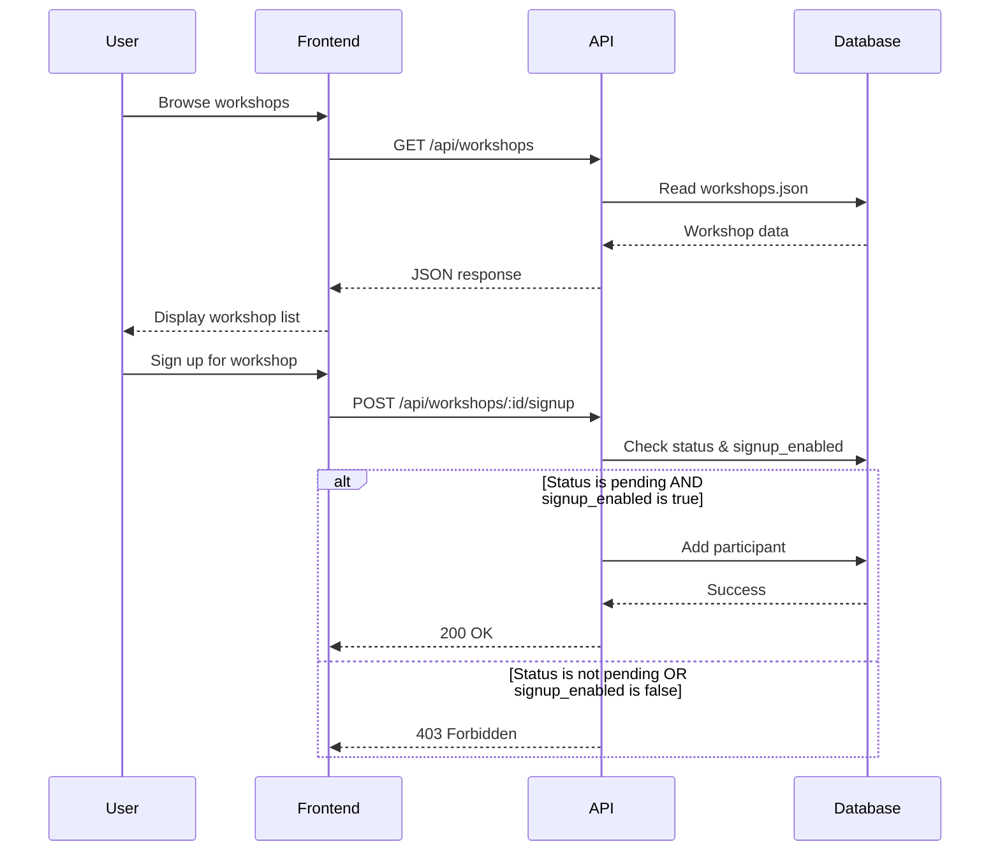
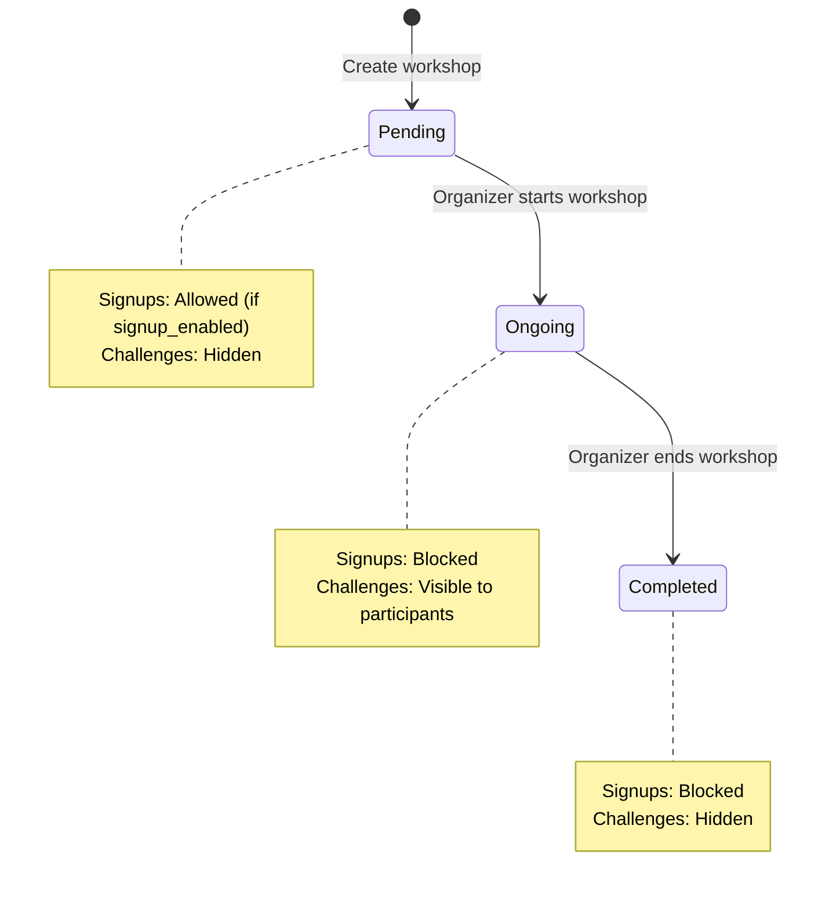
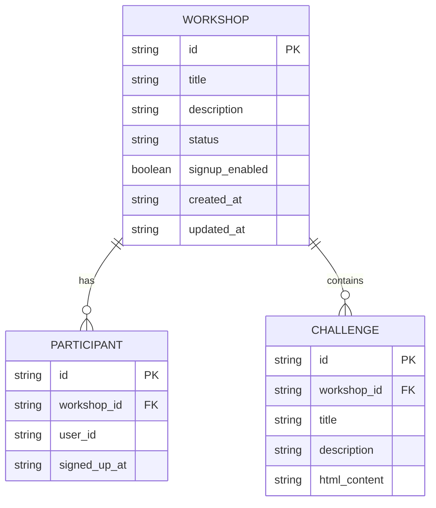

# Design Document: Workshop Management System

## Overview

The Workshop Management System is a full-stack application consisting of a RESTful backend API and a Next.js frontend. The system manages workshop lifecycle states (pending, ongoing, completed) and controls participant access to signups and challenges based on workshop status.

The backend API provides endpoints for workshop CRUD operations, participant signup management, and challenge visibility control. Data is persisted in a JSON-based database with a structured schema supporting workshops, participants, and challenges. The frontend displays workshop listings and provides a user interface for browsing available workshops.

Key design principles:
- State-driven access control: Workshop status determines signup and challenge visibility
- RESTful API design with clear resource boundaries
- JSON database for simple persistence without external dependencies
- Separation of concerns between backend logic and frontend presentation

## Architecture

### System Components

The system follows a three-tier architecture:

1. **Presentation Layer (Frontend)**
   - Next.js application with TailwindCSS styling
   - Consumes REST API endpoints
   - Displays workshop listings and status information

2. **Application Layer (Backend API)**
   - RESTful HTTP endpoints for workshop operations
   - Business logic for status transitions and access control
   - Validation of signup requests and challenge access

3. **Data Layer (JSON Database)**
   - File-based JSON storage
   - Schema enforcement for workshops, participants, and challenges
   - Referential integrity between entities

### Component Interaction Flow



### State Machine for Workshop Status



## Components and Interfaces

### Backend API Components

#### 1. Workshop Controller
Handles HTTP requests for workshop operations.

**Responsibilities:**
- Route handling for workshop endpoints
- Request validation
- Response formatting

**Key Methods:**
- `GET /api/workshops` - List all workshops
- `POST /api/workshops` - Create new workshop
- `PATCH /api/workshops/:id/status` - Update workshop status
- `PATCH /api/workshops/:id/signup-flag` - Toggle signup flag

#### 2. Participant Controller
Manages participant signup operations.

**Responsibilities:**
- Signup request validation
- Access control based on workshop status and signup flag
- Participant list management

**Key Methods:**
- `POST /api/workshops/:id/signup` - Register participant
- `GET /api/workshops/:id/participants` - List participants

#### 3. Challenge Controller
Controls challenge visibility and access.

**Responsibilities:**
- Challenge CRUD operations
- Access control based on workshop status and participant membership
- HTML content validation

**Key Methods:**
- `POST /api/workshops/:id/challenges` - Create challenge
- `GET /api/workshops/:id/challenges` - List challenges (with access control)
- `GET /api/challenges/:id` - Get challenge details (with access control)

#### 4. Database Service
Abstracts JSON file operations.

**Responsibilities:**
- Read/write JSON files
- Schema validation
- Referential integrity checks
- Atomic file operations

**Key Methods:**
- `readWorkshops()` - Load all workshops
- `writeWorkshops(data)` - Persist workshops
- `readParticipants()` - Load all participants
- `writeParticipants(data)` - Persist participants
- `readChallenges()` - Load all challenges
- `writeChallenges(data)` - Persist challenges

#### 5. Access Control Service
Centralizes authorization logic.

**Responsibilities:**
- Determine signup eligibility
- Determine challenge visibility
- Validate participant membership

**Key Methods:**
- `canSignup(workshop)` - Returns boolean based on status and signup_enabled
- `canAccessChallenges(workshop, userId)` - Returns boolean based on status and participant list
- `isParticipant(workshopId, userId)` - Check participant membership

### Frontend Components

#### 1. WorkshopList Component
Displays all workshops in a grid or list layout.

**Props:**
- None (fetches data internally)

**State:**
- `workshops: Workshop[]` - Array of workshop objects
- `loading: boolean` - Loading state
- `error: string | null` - Error message

**Responsibilities:**
- Fetch workshops from API on mount
- Render workshop cards
- Handle loading and error states

#### 2. WorkshopCard Component
Displays individual workshop information.

**Props:**
- `workshop: Workshop` - Workshop object with id, title, description, status, signup_enabled

**Responsibilities:**
- Display workshop title, description, and status
- Apply status-specific styling
- Show signup availability indicator

#### 3. API Client Module
Handles HTTP communication with backend.

**Responsibilities:**
- Construct API requests
- Handle response parsing
- Error handling and retry logic

**Key Functions:**
- `fetchWorkshops()` - GET /api/workshops
- `signupForWorkshop(workshopId, userId)` - POST /api/workshops/:id/signup

### Interface Definitions

#### Workshop Interface
```typescript
interface Workshop {
  id: string;
  title: string;
  description: string;
  status: 'pending' | 'ongoing' | 'completed';
  signup_enabled: boolean;
  created_at: string; // ISO 8601 timestamp
  updated_at: string; // ISO 8601 timestamp
}
```

#### Participant Interface
```typescript
interface Participant {
  id: string;
  workshop_id: string;
  user_id: string;
  signed_up_at: string; // ISO 8601 timestamp
}
```

#### Challenge Interface
```typescript
interface Challenge {
  id: string;
  workshop_id: string;
  title: string; // max 200 characters
  description: string; // max 1000 characters
  html_content: string;
}
```

#### API Response Interfaces
```typescript
interface WorkshopListResponse {
  workshops: Workshop[];
}

interface SignupResponse {
  success: boolean;
  participant_id?: string;
  error?: string;
}

interface ChallengeListResponse {
  challenges: Challenge[];
}

interface ErrorResponse {
  error: string;
  code: string;
}
```

## Data Models

### Database Schema

The JSON database consists of three main files:

#### workshops.json
```json
{
  "workshops": [
    {
      "id": "uuid-v4",
      "title": "string (max 200 chars)",
      "description": "string (max 1000 chars)",
      "status": "pending | ongoing | completed",
      "signup_enabled": true,
      "created_at": "ISO 8601 timestamp",
      "updated_at": "ISO 8601 timestamp"
    }
  ]
}
```

#### participants.json
```json
{
  "participants": [
    {
      "id": "uuid-v4",
      "workshop_id": "uuid-v4 (foreign key to workshops)",
      "user_id": "string",
      "signed_up_at": "ISO 8601 timestamp"
    }
  ]
}
```

#### challenges.json
```json
{
  "challenges": [
    {
      "id": "uuid-v4",
      "workshop_id": "uuid-v4 (foreign key to workshops)",
      "title": "string (max 200 chars)",
      "description": "string (max 1000 chars)",
      "html_content": "string (valid HTML)"
    }
  ]
}
```

### Data Relationships



### Data Validation Rules

1. **Workshop Validation**
   - `id`: Must be valid UUID v4
   - `title`: Required, 1-200 characters
   - `description`: Required, 1-1000 characters
   - `status`: Must be one of: 'pending', 'ongoing', 'completed'
   - `signup_enabled`: Must be boolean
   - `created_at`, `updated_at`: Must be valid ISO 8601 timestamps

2. **Participant Validation**
   - `id`: Must be valid UUID v4
   - `workshop_id`: Must reference existing workshop
   - `user_id`: Required, non-empty string
   - `signed_up_at`: Must be valid ISO 8601 timestamp
   - Uniqueness constraint: (workshop_id, user_id) must be unique

3. **Challenge Validation**
   - `id`: Must be valid UUID v4
   - `workshop_id`: Must reference existing workshop
   - `title`: Required, 1-200 characters
   - `description`: Required, 1-1000 characters
   - `html_content`: Required, must be valid HTML (basic validation)

### Database Operations

#### Atomic Write Operations
All write operations must follow this pattern:
1. Read current data from JSON file
2. Validate new data
3. Apply changes to in-memory structure
4. Write entire structure back to file atomically
5. Handle file system errors gracefully

#### Referential Integrity
- Before deleting a workshop, check for associated participants and challenges
- When creating participants or challenges, verify workshop exists
- Maintain consistency across all three JSON files


## Correctness Properties

*A property is a characteristic or behavior that should hold true across all valid executions of a system—essentially, a formal statement about what the system should do. Properties serve as the bridge between human-readable specifications and machine-verifiable correctness guarantees.*

### Property 1: Workshop Status Enum Constraint

*For any* workshop creation or update request, the status field must be one of exactly three values: 'pending', 'ongoing', or 'completed', and any other value must be rejected.

**Validates: Requirements 1.1**

### Property 2: Default Workshop State

*For any* newly created workshop, the status must be 'pending' and signup_enabled must be true.

**Validates: Requirements 1.2, 6.4**

### Property 3: Signup Eligibility Rule

*For any* workshop and signup request, the signup is accepted if and only if the workshop status is 'pending' AND signup_enabled is true. All other combinations (status='ongoing', status='completed', or signup_enabled=false) must reject the signup.

**Validates: Requirements 1.3, 2.1, 2.3, 2.4, 6.2, 6.3**

### Property 4: Signup Effect on Participant List

*For any* successful signup request, the participant must appear in the workshop's participant list with a unique participant record containing the correct workshop_id and user_id.

**Validates: Requirements 2.2**

### Property 5: Challenge Visibility Rule

*For any* workshop and challenge access request from a signed-up participant, challenges are accessible if and only if the workshop status is 'ongoing'. For pending or completed workshops, challenge access must be denied regardless of participant status.

**Validates: Requirements 1.4, 3.1, 3.2, 3.3**

### Property 6: Non-Participant Challenge Access Denial

*For any* challenge access request from a user who is not signed up for the workshop, the system must return an authorization error regardless of workshop status.

**Validates: Requirements 3.4**

### Property 7: Workshop Schema Completeness

*For any* workshop record in the database, it must contain all required fields: id (valid UUID v4), title (non-empty string), description (non-empty string), status (valid enum), signup_enabled (boolean), created_at (valid ISO 8601 timestamp), and updated_at (valid ISO 8601 timestamp).

**Validates: Requirements 4.1, 6.1**

### Property 8: Participant Schema Completeness

*For any* participant record in the database, it must contain all required fields: id (valid UUID v4), workshop_id (valid UUID v4), user_id (non-empty string), and signed_up_at (valid ISO 8601 timestamp).

**Validates: Requirements 4.2**

### Property 9: Challenge Schema Completeness

*For any* challenge record in the database, it must contain all required fields: id (valid UUID v4), workshop_id (valid UUID v4), title (non-empty string), description (non-empty string), and html_content (non-empty string).

**Validates: Requirements 4.3**

### Property 10: Referential Integrity

*For any* participant or challenge record, the workshop_id field must reference an existing workshop in the database. Attempting to create a participant or challenge with a non-existent workshop_id must be rejected.

**Validates: Requirements 4.4, 5.4**

### Property 11: Database Persistence Round Trip

*For any* valid entity (workshop, participant, or challenge), writing it to the database and then reading it back must produce an equivalent entity with all fields preserved.

**Validates: Requirements 1.5, 4.5, 5.5, 6.5**

### Property 12: Challenge Field Length Constraints

*For any* challenge creation request, titles with length ≤ 200 characters and descriptions with length ≤ 1000 characters must be accepted, while titles > 200 characters or descriptions > 1000 characters must be rejected.

**Validates: Requirements 5.1, 5.2**

### Property 13: HTML Content Validation

*For any* challenge creation request with html_content, the system must accept valid HTML strings and reject malformed HTML (basic validation for matching tags and proper structure).

**Validates: Requirements 5.3**

### Property 14: Workshop List Response Format

*For any* GET request to the workshop listing endpoint, the response must be valid JSON containing an array where each workshop object includes at minimum: id, title, description, status, and signup_enabled fields.

**Validates: Requirements 7.2, 7.3**

### Property 15: Frontend Workshop Rendering Completeness

*For any* workshop received from the API, the frontend must render all three key fields: title, description, and status in the displayed output.

**Validates: Requirements 8.1, 8.3**

### Property 16: Frontend Error Display

*For any* error response from the API, the frontend must display an error message to the user (error message must be present in the rendered output).

**Validates: Requirements 8.5**

### Property 17: Participant Uniqueness Constraint

*For any* workshop, a given user_id can only appear once in the participant list. Attempting to sign up the same user twice for the same workshop must be rejected.

**Validates: Data integrity requirement (implicit in participant management)**

## Error Handling

### Backend API Error Responses

All API errors must follow a consistent format:

```typescript
interface ErrorResponse {
  error: string;        // Human-readable error message
  code: string;         // Machine-readable error code
  status: number;       // HTTP status code
}
```

### Error Categories

#### 1. Validation Errors (400 Bad Request)
- Invalid workshop status value
- Missing required fields
- Field length violations (title > 200, description > 1000)
- Invalid UUID format
- Invalid HTML content
- Malformed JSON in request body

**Example:**
```json
{
  "error": "Challenge title exceeds maximum length of 200 characters",
  "code": "VALIDATION_ERROR",
  "status": 400
}
```

#### 2. Authorization Errors (403 Forbidden)
- Signup attempt for non-pending workshop
- Signup attempt when signup_enabled is false
- Challenge access attempt for non-ongoing workshop
- Challenge access attempt by non-participant
- Duplicate signup attempt

**Example:**
```json
{
  "error": "Signups are not allowed for workshops with status 'ongoing'",
  "code": "SIGNUP_NOT_ALLOWED",
  "status": 403
}
```

#### 3. Not Found Errors (404 Not Found)
- Workshop ID does not exist
- Challenge ID does not exist
- Participant ID does not exist

**Example:**
```json
{
  "error": "Workshop with id 'abc-123' not found",
  "code": "WORKSHOP_NOT_FOUND",
  "status": 404
}
```

#### 4. Database Errors (500 Internal Server Error)
- JSON file read/write failures
- File system permission errors
- Corrupted JSON data
- Atomic write operation failures

**Example:**
```json
{
  "error": "Failed to persist workshop data",
  "code": "DATABASE_ERROR",
  "status": 500
}
```

### Frontend Error Handling

The frontend must handle errors gracefully:

1. **Network Errors**: Display "Unable to connect to server" message
2. **API Errors**: Display the error message from the API response
3. **Timeout Errors**: Display "Request timed out, please try again"
4. **Unexpected Errors**: Display generic "An error occurred" message with option to retry

### Error Recovery Strategies

1. **Retry Logic**: Implement exponential backoff for transient failures (network errors, 500 errors)
2. **Graceful Degradation**: Show cached data when API is unavailable
3. **User Feedback**: Always inform users when operations fail and provide actionable next steps
4. **Logging**: Log all errors server-side for debugging and monitoring

## Testing Strategy

### Dual Testing Approach

The Workshop Management System requires both unit testing and property-based testing for comprehensive coverage:

- **Unit tests**: Verify specific examples, edge cases, and error conditions
- **Property tests**: Verify universal properties across all inputs

Both testing approaches are complementary and necessary. Unit tests catch concrete bugs and validate specific scenarios, while property tests verify general correctness across a wide range of inputs.

### Unit Testing Strategy

Unit tests should focus on:

1. **Specific Examples**
   - Creating a workshop with valid data returns 201
   - Signing up for a pending workshop succeeds
   - Accessing challenges in an ongoing workshop succeeds
   - Empty database returns empty array

2. **Edge Cases**
   - Workshop with exactly 200 character title
   - Challenge with exactly 1000 character description
   - Empty workshop list
   - Single participant in workshop
   - Workshop with no challenges

3. **Error Conditions**
   - Invalid status value rejected
   - Missing required fields rejected
   - Non-existent workshop_id rejected
   - Duplicate participant signup rejected
   - Malformed JSON rejected

4. **Integration Points**
   - API endpoint routing
   - Database file operations
   - Frontend API client communication
   - Component rendering with mock data

### Property-Based Testing Strategy

Property-based testing will use **fast-check** (for TypeScript/JavaScript) to generate random test inputs and verify universal properties.

**Configuration:**
- Minimum 100 iterations per property test
- Each test must reference its design document property
- Tag format: `// Feature: workshop-management-system, Property {number}: {property_text}`

**Property Test Implementation:**

1. **Property 1-2: Workshop Creation Properties**
   - Generate random workshop data
   - Verify status enum constraint
   - Verify default values

2. **Property 3-4: Signup Properties**
   - Generate random workshops with various status/signup_enabled combinations
   - Generate random signup requests
   - Verify signup eligibility rule
   - Verify participant list updates

3. **Property 5-6: Challenge Visibility Properties**
   - Generate random workshops with various statuses
   - Generate random participant lists
   - Verify challenge access rules

4. **Property 7-9: Schema Properties**
   - Generate random entities
   - Verify all required fields present
   - Verify field types and formats

5. **Property 10: Referential Integrity**
   - Generate random participant/challenge records
   - Verify workshop_id references exist

6. **Property 11: Persistence Round Trip**
   - Generate random entities
   - Write to database, read back
   - Verify equivalence

7. **Property 12-13: Validation Properties**
   - Generate random strings of various lengths
   - Generate random HTML content
   - Verify acceptance/rejection rules

8. **Property 14-16: API and Frontend Properties**
   - Generate random workshop lists
   - Verify response format
   - Verify rendering completeness

9. **Property 17: Uniqueness Constraint**
   - Generate random participant lists
   - Verify no duplicate (workshop_id, user_id) pairs

### Test Data Generators

Property-based tests require custom generators:

```typescript
// Example generator for workshops
const workshopGenerator = fc.record({
  id: fc.uuid(),
  title: fc.string({ minLength: 1, maxLength: 200 }),
  description: fc.string({ minLength: 1, maxLength: 1000 }),
  status: fc.constantFrom('pending', 'ongoing', 'completed'),
  signup_enabled: fc.boolean(),
  created_at: fc.date().map(d => d.toISOString()),
  updated_at: fc.date().map(d => d.toISOString())
});

// Example generator for participants
const participantGenerator = (workshopId: string) => fc.record({
  id: fc.uuid(),
  workshop_id: fc.constant(workshopId),
  user_id: fc.string({ minLength: 1, maxLength: 50 }),
  signed_up_at: fc.date().map(d => d.toISOString())
});

// Example generator for challenges
const challengeGenerator = (workshopId: string) => fc.record({
  id: fc.uuid(),
  workshop_id: fc.constant(workshopId),
  title: fc.string({ minLength: 1, maxLength: 200 }),
  description: fc.string({ minLength: 1, maxLength: 1000 }),
  html_content: fc.string({ minLength: 1 }) // Could use more sophisticated HTML generator
});
```

### Testing Tools and Frameworks

**Backend:**
- **Jest**: Unit testing framework
- **fast-check**: Property-based testing library
- **Supertest**: HTTP endpoint testing
- **ts-node**: TypeScript execution for tests

**Frontend:**
- **Jest**: Unit testing framework
- **React Testing Library**: Component testing
- **fast-check**: Property-based testing for rendering logic
- **MSW (Mock Service Worker)**: API mocking

### Test Coverage Goals

- **Line Coverage**: Minimum 80%
- **Branch Coverage**: Minimum 75%
- **Property Test Coverage**: All 17 properties must have corresponding tests
- **Critical Path Coverage**: 100% (signup flow, challenge access, status transitions)

### Continuous Integration

All tests must pass before merging:
1. Run unit tests
2. Run property-based tests (100 iterations minimum)
3. Generate coverage report
4. Verify coverage thresholds met
5. Run linting and type checking

