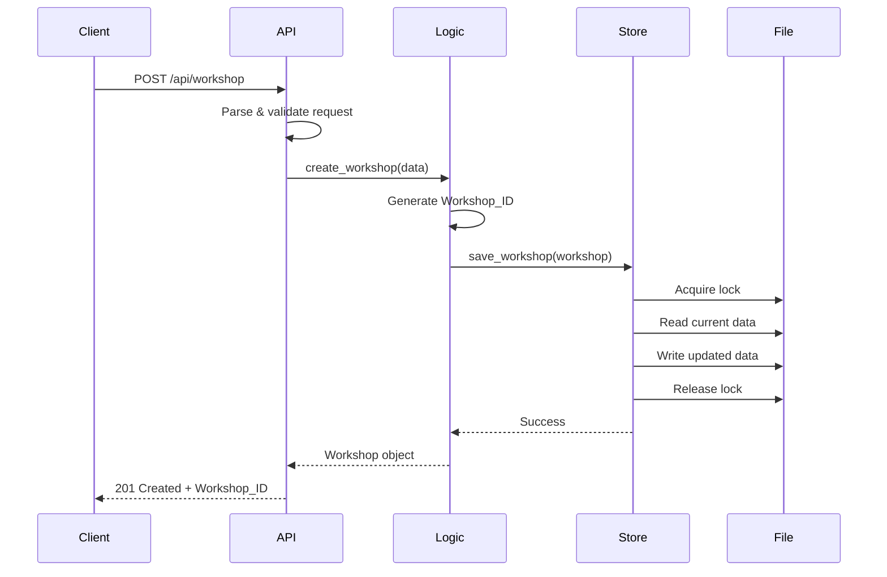

# Design Document: Workshop Management Backend

## Overview

The workshop management backend is a REST API built with Python Flask that enables organizers to create and manage workshops while allowing participants to register and contribute challenges. The system uses a JSON file-based persistence layer for simplicity and portability.

### Key Design Goals

- Simple, RESTful API design following Flask conventions
- Thread-safe JSON file operations for data persistence
- Clear separation between API routes, business logic, and data access
- Comprehensive input validation with descriptive error messages
- Atomic operations to prevent data corruption during concurrent access

### Technology Stack

- **Framework**: Flask (Python web framework)
- **Data Storage**: JSON file in project directory
- **Validation**: Custom validators with Flask request parsing
- **Concurrency**: File locking mechanism for thread-safe writes

## Architecture

### Layered Architecture

The system follows a three-layer architecture:

```
┌─────────────────────────────────────┐
│     API Layer (Flask Routes)        │
│  - Request parsing & validation     │
│  - Response formatting              │
│  - HTTP status code handling        │
└─────────────────────────────────────┘
              ↓
┌─────────────────────────────────────┐
│     Business Logic Layer            │
│  - Workshop management              │
│  - Challenge management             │
│  - Registration management          │
│  - Capacity validation              │
└─────────────────────────────────────┘
              ↓
┌─────────────────────────────────────┐
│     Data Access Layer               │
│  - JSON file read/write             │
│  - File locking                     │
│  - Data serialization               │
└─────────────────────────────────────┘
```

### Request Flow



## Components and Interfaces

### 1. API Layer Components

#### Flask Application (`app.py`)

Main application entry point that configures Flask and registers routes.

```python
# Key responsibilities:
# - Initialize Flask app
# - Configure JSON file path
# - Register error handlers
# - Register route blueprints
```

#### Workshop Routes (`routes/workshop_routes.py`)

Handles all workshop-related endpoints.

**Endpoints:**

- `POST /api/workshop` - Create new workshop
- `GET /api/workshop` - List all workshops
- `GET /api/workshop/{id}` - Get specific workshop
- `POST /api/workshop/{id}/challenge` - Create challenge for workshop
- `POST /api/workshop/{id}/register` - Register for workshop
- `GET /api/workshop/registrations` - List all registrations

**Interface:**

```python
@blueprint.route('/api/workshop', methods=['POST'])
def create_workshop():
    # Returns: (response_body, status_code)
    pass

@blueprint.route('/api/workshop', methods=['GET'])
def list_workshops():
    # Returns: (response_body, status_code)
    pass

@blueprint.route('/api/workshop/<workshop_id>', methods=['GET'])
def get_workshop(workshop_id):
    # Returns: (response_body, status_code)
    pass

@blueprint.route('/api/workshop/<workshop_id>/challenge', methods=['POST'])
def create_challenge(workshop_id):
    # Returns: (response_body, status_code)
    pass

@blueprint.route('/api/workshop/<workshop_id>/register', methods=['POST'])
def register_for_workshop(workshop_id):
    # Returns: (response_body, status_code)
    pass

@blueprint.route('/api/workshop/registrations', methods=['GET'])
def list_registrations():
    # Returns: (response_body, status_code)
    pass
```

#### Request Validators (`validators.py`)

Provides validation functions for incoming requests.

**Interface:**

```python
def validate_workshop_data(data: dict) -> tuple[bool, str]:
    """
    Validates workshop creation data.
    Returns: (is_valid, error_message)
    """
    pass

def validate_challenge_data(data: dict) -> tuple[bool, str]:
    """
    Validates challenge creation data.
    Returns: (is_valid, error_message)
    """
    pass

def validate_registration_data(data: dict) -> tuple[bool, str]:
    """
    Validates registration data.
    Returns: (is_valid, error_message)
    """
    pass

def validate_delivery_mode(mode: str) -> bool:
    """
    Validates delivery mode is one of: online, face-to-face, hybrid.
    Returns: True if valid, False otherwise
    """
    pass

def validate_time_range(start_time: str, end_time: str) -> bool:
    """
    Validates that start_time occurs before end_time.
    Returns: True if valid, False otherwise
    """
    pass
```

### 2. Business Logic Layer Components

#### Workshop Service (`services/workshop_service.py`)

Manages workshop-related business logic.

**Interface:**

```python
class WorkshopService:
    def create_workshop(self, data: dict) -> dict:
        """
        Creates a new workshop with generated ID and initial registration count.
        Returns: Workshop object with ID
        """
        pass
    
    def get_workshop(self, workshop_id: str) -> dict | None:
        """
        Retrieves a workshop by ID.
        Returns: Workshop object or None if not found
        """
        pass
    
    def list_workshops(self) -> list[dict]:
        """
        Retrieves all workshops.
        Returns: List of workshop objects
        """
        pass
    
    def workshop_exists(self, workshop_id: str) -> bool:
        """
        Checks if a workshop exists.
        Returns: True if exists, False otherwise
        """
        pass
```

#### Challenge Service (`services/challenge_service.py`)

Manages challenge-related business logic.

**Interface:**

```python
class ChallengeService:
    def create_challenge(self, workshop_id: str, data: dict) -> dict:
        """
        Creates a new challenge for a workshop.
        Returns: Challenge object with ID
        """
        pass
    
    def list_challenges(self, workshop_id: str) -> list[dict]:
        """
        Retrieves all challenges for a workshop.
        Returns: List of challenge objects
        """
        pass
```

#### Registration Service (`services/registration_service.py`)

Manages registration-related business logic including capacity checks.

**Interface:**

```python
class RegistrationService:
    def register_participant(self, workshop_id: str, data: dict) -> tuple[dict | None, str]:
        """
        Registers a participant for a workshop.
        Checks capacity before registration.
        Returns: (Registration object with ID, error_message)
        """
        pass
    
    def list_registrations(self) -> list[dict]:
        """
        Retrieves all registrations.
        Returns: List of registration objects
        """
        pass
    
    def get_registration_count(self, workshop_id: str) -> int:
        """
        Gets current registration count for a workshop.
        Returns: Number of registrations
        """
        pass
```

### 3. Data Access Layer Components

#### Workshop Store (`store/workshop_store.py`)

Provides thread-safe JSON file operations.

**Interface:**

```python
class WorkshopStore:
    def __init__(self, file_path: str):
        """
        Initializes store with JSON file path.
        Creates file if it doesn't exist.
        """
        pass
    
    def load_data(self) -> dict:
        """
        Loads all data from JSON file.
        Returns: Dictionary with workshops, challenges, registrations
        """
        pass
    
    def save_data(self, data: dict) -> None:
        """
        Saves all data to JSON file with file locking.
        """
        pass
    
    def add_workshop(self, workshop: dict) -> None:
        """
        Adds a workshop to the store.
        """
        pass
    
    def get_workshop(self, workshop_id: str) -> dict | None:
        """
        Retrieves a workshop by ID.
        """
        pass
    
    def get_all_workshops(self) -> list[dict]:
        """
        Retrieves all workshops.
        """
        pass
    
    def add_challenge(self, challenge: dict) -> None:
        """
        Adds a challenge to the store.
        """
        pass
    
    def get_challenges(self, workshop_id: str) -> list[dict]:
        """
        Retrieves all challenges for a workshop.
        """
        pass
    
    def add_registration(self, registration: dict) -> None:
        """
        Adds a registration to the store.
        """
        pass
    
    def get_all_registrations(self) -> list[dict]:
        """
        Retrieves all registrations.
        """
        pass
    
    def get_registrations_for_workshop(self, workshop_id: str) -> list[dict]:
        """
        Retrieves all registrations for a specific workshop.
        """
        pass
    
    def update_workshop(self, workshop: dict) -> None:
        """
        Updates an existing workshop in the store.
        """
        pass
```

#### File Lock Manager (`store/file_lock.py`)

Provides file locking for concurrent access safety.

**Interface:**

```python
class FileLock:
    def __init__(self, file_path: str):
        """
        Initializes file lock for given path.
        """
        pass
    
    def __enter__(self):
        """
        Acquires exclusive lock on file.
        """
        pass
    
    def __exit__(self, exc_type, exc_val, exc_tb):
        """
        Releases lock on file.
        """
        pass
```

## Data Models

### Workshop

```python
{
    "id": "string (UUID)",
    "title": "string (non-empty)",
    "description": "string",
    "start_time": "string (ISO 8601)",
    "end_time": "string (ISO 8601)",
    "capacity": "integer (positive)",
    "delivery_mode": "string (online|face-to-face|hybrid)",
    "registration_count": "integer (non-negative)"
}
```

**Constraints:**
- `id`: Generated UUID, unique across all workshops
- `title`: Required, non-empty string
- `start_time`: Must occur before `end_time`
- `capacity`: Must be positive integer (> 0)
- `delivery_mode`: Must be one of: "online", "face-to-face", "hybrid"
- `registration_count`: Initialized to 0, must not exceed `capacity`

### Challenge

```python
{
    "id": "string (UUID)",
    "workshop_id": "string (UUID, foreign key)",
    "title": "string (non-empty)",
    "description": "string",
    "created_at": "string (ISO 8601)"
}
```

**Constraints:**
- `id`: Generated UUID, unique across all challenges
- `workshop_id`: Must reference an existing workshop
- `title`: Required, non-empty string
- `created_at`: Timestamp of challenge creation

### Registration

```python
{
    "id": "string (UUID)",
    "workshop_id": "string (UUID, foreign key)",
    "participant_name": "string",
    "participant_email": "string",
    "registered_at": "string (ISO 8601)"
}
```

**Constraints:**
- `id`: Generated UUID, unique across all registrations
- `workshop_id`: Must reference an existing workshop
- `registered_at`: Timestamp of registration

### JSON File Structure

The JSON file stores all data in a single root object:

```python
{
    "workshops": [
        {Workshop objects}
    ],
    "challenges": [
        {Challenge objects}
    ],
    "registrations": [
        {Registration objects}
    ]
}
```

## Correctness Properties

*A property is a characteristic or behavior that should hold true across all valid executions of a system-essentially, a formal statement about what the system should do. Properties serve as the bridge between human-readable specifications and machine-verifiable correctness guarantees.*


### Property 1: Workshop Creation with Valid Data

*For any* valid workshop data (non-empty title, valid time range where start < end, positive capacity, valid delivery mode), creating a workshop should return a 201 status with a unique Workshop_ID, and the workshop should be retrievable with all provided data intact.

**Validates: Requirements 1.1, 1.7, 2.1**

### Property 2: Non-Empty Title Validation

*For any* workshop or challenge creation request with an empty or whitespace-only title, the API should return a 400 status with a descriptive error message, and no entity should be created.

**Validates: Requirements 1.2, 4.3**

### Property 3: Time Range Validation

*For any* workshop creation request where start_time is greater than or equal to end_time, the API should return a 400 status with a descriptive error message, and no workshop should be created.

**Validates: Requirements 1.3**

### Property 4: Positive Capacity Validation

*For any* workshop creation request with a capacity that is zero, negative, or not an integer, the API should return a 400 status with a descriptive error message, and no workshop should be created.

**Validates: Requirements 1.4**

### Property 5: Delivery Mode Validation

*For any* workshop creation request with a delivery_mode that is not one of "online", "face-to-face", or "hybrid", the API should return a 400 status with a descriptive error message, and no workshop should be created.

**Validates: Requirements 1.5**

### Property 6: Persistence Round-Trip

*For any* workshop, challenge, or registration created through the API, reloading the data from the JSON file should return an equivalent entity with all fields preserved.

**Validates: Requirements 1.8, 4.6, 6.6, 9.1, 9.2, 9.3, 9.4**

### Property 7: Non-Existent Resource Returns 404

*For any* request to retrieve a workshop by ID, create a challenge for a workshop, or register for a workshop, if the workshop ID does not exist, the API should return a 404 status.

**Validates: Requirements 2.2, 4.2, 6.5**

### Property 8: Complete Workshop Data in Responses

*For any* workshop retrieved individually or in a list, the response should include all required fields: id, title, description, start_time, end_time, capacity, delivery_mode, and registration_count.

**Validates: Requirements 2.3, 3.3**

### Property 9: List All Created Workshops

*For any* set of workshops created through the API, requesting the workshop list should return all created workshops with a 200 status.

**Validates: Requirements 3.1**

### Property 10: Challenge Creation for Existing Workshop

*For any* existing workshop and valid challenge data (non-empty title), creating a challenge should return a 201 status with a unique Challenge_ID, and the challenge should be associated with the correct workshop.

**Validates: Requirements 4.1, 5.1**

### Property 11: Registration Creation and Count Increment

*For any* existing workshop with available capacity and valid registration data, creating a registration should return a 201 status with a unique Registration_ID, and the workshop's registration_count should increment by exactly one.

**Validates: Requirements 6.1, 6.2**

### Property 12: Capacity Enforcement

*For any* workshop, attempting to register when the registration count equals capacity should return a 409 status, and the registration should not be created.

**Validates: Requirements 6.3**

### Property 13: Registration Count Invariant

*For any* workshop at any point in time, the registration_count must be less than or equal to the capacity.

**Validates: Requirements 6.4**

### Property 14: List All Created Registrations

*For any* set of registrations created through the API, requesting the registration list should return all created registrations with a 200 status.

**Validates: Requirements 7.1**

### Property 15: Complete Registration Data in Responses

*For any* registration retrieved in a list, the response should include all required fields: id, workshop_id, participant information, and registration timestamp.

**Validates: Requirements 7.3**

### Property 16: Missing Required Fields Validation

*For any* API request missing required fields, the API should return a 400 status with an error message listing the missing fields, and no entity should be created.

**Validates: Requirements 8.2**

### Property 17: Invalid Data Type Validation

*For any* API request with fields containing invalid data types, the API should return a 400 status with an error message describing the type mismatch, and no entity should be created.

**Validates: Requirements 8.3**

### Property 18: JSON Response Format

*For any* API request, the response should be valid JSON with a Content-Type header of application/json.

**Validates: Requirements 10.1, 10.2**

### Property 19: ISO 8601 Timestamp Format

*For any* entity with timestamps (challenges, registrations, workshop times), the timestamps should be represented in valid ISO 8601 format.

**Validates: Requirements 10.4**

## Error Handling

### Error Response Structure

All error responses follow a consistent JSON structure:

```python
{
    "error": "Brief error description",
    "message": "Detailed error message",
    "status": 400  # HTTP status code
}
```

### Error Categories

#### 400 Bad Request

Returned when:
- Request contains malformed JSON
- Required fields are missing
- Field values fail validation (empty title, invalid time range, invalid capacity, invalid delivery mode)
- Field data types are incorrect

Example:
```python
{
    "error": "Validation Error",
    "message": "Title must be a non-empty string",
    "status": 400
}
```

#### 404 Not Found

Returned when:
- Requested workshop ID does not exist
- Attempting to create challenge for non-existent workshop
- Attempting to register for non-existent workshop

Example:
```python
{
    "error": "Not Found",
    "message": "Workshop with ID 'abc-123' does not exist",
    "status": 404
}
```

#### 409 Conflict

Returned when:
- Attempting to register for a workshop that has reached capacity

Example:
```python
{
    "error": "Conflict",
    "message": "Workshop is full. Registration count has reached capacity.",
    "status": 409
}
```

#### 500 Internal Server Error

Returned when:
- Unexpected server errors occur
- File system errors during persistence operations

Example:
```python
{
    "error": "Internal Server Error",
    "message": "An unexpected error occurred. Please try again later.",
    "status": 500
}
```

### Error Handling Strategy

1. **Input Validation**: All inputs are validated before processing. Validation errors return 400 with specific error messages.

2. **Resource Existence**: All resource references (workshop IDs) are validated before operations. Missing resources return 404.

3. **Business Rule Enforcement**: Business rules (capacity limits) are enforced before state changes. Violations return 409.

4. **File System Errors**: File operations are wrapped in try-except blocks. File errors are logged and return 500.

5. **Atomic Operations**: All operations that modify state use file locking to ensure atomicity. If an operation fails partway through, the file lock ensures no partial writes occur.

## Testing Strategy

### Dual Testing Approach

The testing strategy employs both unit tests and property-based tests to ensure comprehensive coverage:

- **Unit Tests**: Verify specific examples, edge cases, and error conditions
- **Property-Based Tests**: Verify universal properties across randomly generated inputs

Both approaches are complementary and necessary for comprehensive validation.

### Unit Testing

Unit tests focus on:

1. **Specific Examples**
   - Creating a workshop with specific valid data
   - Registering a participant with specific data
   - Creating a challenge with specific data

2. **Edge Cases**
   - Empty workshop list when no workshops exist (Requirement 3.2)
   - Empty registration list when no registrations exist (Requirement 7.2)
   - Malformed JSON in request body (Requirement 8.1)
   - Workshop at exactly capacity limit

3. **Integration Points**
   - Flask route handlers correctly call service layer
   - Service layer correctly calls data access layer
   - File locking prevents concurrent write conflicts

4. **Error Conditions**
   - Specific validation failures (empty title, invalid delivery mode)
   - Specific 404 scenarios (non-existent workshop ID)
   - Specific 409 scenarios (workshop at capacity)

### Property-Based Testing

Property-based tests verify universal properties using randomly generated inputs. Each test runs a minimum of 100 iterations to ensure comprehensive coverage.

**Testing Library**: Use `hypothesis` for Python property-based testing.

**Test Configuration**:
```python
from hypothesis import given, settings
import hypothesis.strategies as st

@settings(max_examples=100)
@given(workshop_data=st.fixed_dictionaries({
    'title': st.text(min_size=1),
    'description': st.text(),
    'start_time': st.datetimes(),
    'end_time': st.datetimes(),
    'capacity': st.integers(min_value=1),
    'delivery_mode': st.sampled_from(['online', 'face-to-face', 'hybrid'])
}))
def test_property_1_workshop_creation(workshop_data):
    """
    Feature: workshop-management, Property 1: Workshop Creation with Valid Data
    For any valid workshop data, creating a workshop should return 201 with unique ID
    """
    # Test implementation
    pass
```

**Property Test Tags**: Each property test must include a comment tag referencing the design document property:

```python
"""
Feature: workshop-management, Property {number}: {property_text}
"""
```

**Property Test Coverage**:

Each of the 19 correctness properties defined in this document must have a corresponding property-based test:

1. Property 1: Workshop Creation with Valid Data
2. Property 2: Non-Empty Title Validation
3. Property 3: Time Range Validation
4. Property 4: Positive Capacity Validation
5. Property 5: Delivery Mode Validation
6. Property 6: Persistence Round-Trip
7. Property 7: Non-Existent Resource Returns 404
8. Property 8: Complete Workshop Data in Responses
9. Property 9: List All Created Workshops
10. Property 10: Challenge Creation for Existing Workshop
11. Property 11: Registration Creation and Count Increment
12. Property 12: Capacity Enforcement
13. Property 13: Registration Count Invariant
14. Property 14: List All Created Registrations
15. Property 15: Complete Registration Data in Responses
16. Property 16: Missing Required Fields Validation
17. Property 17: Invalid Data Type Validation
18. Property 18: JSON Response Format
19. Property 19: ISO 8601 Timestamp Format

**Generator Strategies**:

Custom generators for domain objects:

```python
# Valid workshop data generator
valid_workshops = st.fixed_dictionaries({
    'title': st.text(min_size=1, max_size=100).filter(lambda s: s.strip()),
    'description': st.text(max_size=500),
    'start_time': st.datetimes(min_value=datetime(2024, 1, 1)),
    'end_time': st.datetimes(min_value=datetime(2024, 1, 2)),
    'capacity': st.integers(min_value=1, max_value=1000),
    'delivery_mode': st.sampled_from(['online', 'face-to-face', 'hybrid'])
}).filter(lambda w: w['start_time'] < w['end_time'])

# Invalid title generator (for validation tests)
invalid_titles = st.one_of(
    st.just(''),
    st.text(max_size=0),
    st.from_regex(r'^\s+$', fullmatch=True),  # whitespace only
    st.none(),
    st.integers(),
    st.lists(st.text())
)

# Invalid capacity generator
invalid_capacities = st.one_of(
    st.integers(max_value=0),
    st.floats(),
    st.text(),
    st.none()
)
```

### Test Organization

```
tests/
├── unit/
│   ├── test_routes.py          # Flask route handler tests
│   ├── test_validators.py      # Input validation tests
│   ├── test_services.py        # Business logic tests
│   └── test_store.py           # Data access tests
├── property/
│   ├── test_workshop_properties.py      # Properties 1-9
│   ├── test_challenge_properties.py     # Property 10
│   ├── test_registration_properties.py  # Properties 11-15
│   ├── test_validation_properties.py    # Properties 2-5, 16-17
│   └── test_format_properties.py        # Properties 18-19
└── integration/
    └── test_api_integration.py  # End-to-end API tests
```

### Testing Best Practices

1. **Isolation**: Each test should be independent. Use setup/teardown to create fresh JSON files for each test.

2. **Cleanup**: Always clean up test JSON files after tests complete.

3. **Deterministic IDs**: For unit tests, consider using fixed UUIDs to make tests deterministic.

4. **Concurrent Testing**: Include tests that simulate concurrent requests to verify file locking works correctly.

5. **Coverage Goals**: Aim for 90%+ code coverage with unit tests, and ensure all 19 properties have property-based tests.

6. **Balance**: Don't write excessive unit tests for scenarios covered by property tests. Focus unit tests on specific examples and integration points.

